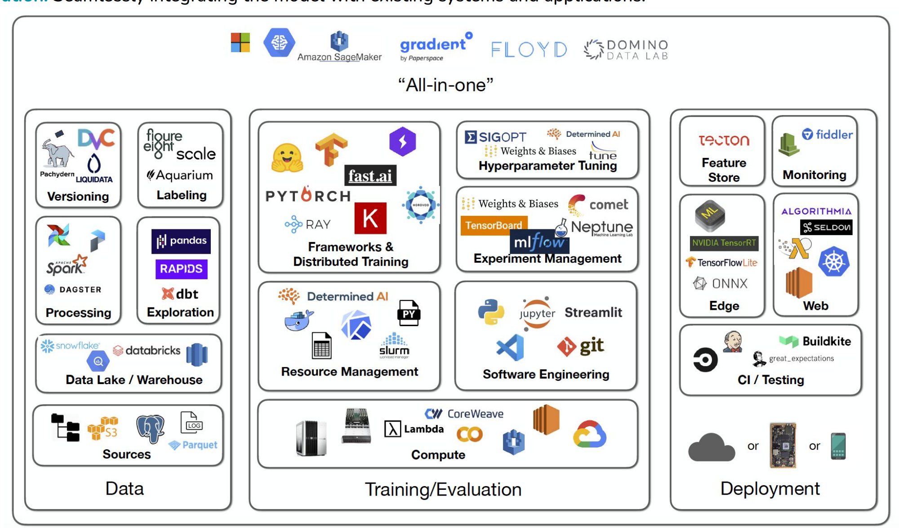

# 📦 Types of Model Deployment

### 1. **Batch Deployment**

* Models are run on a schedule (e.g., hourly, daily).
* Suitable for use cases like monthly credit scoring or churn prediction.
* Input/output processed in bulk.

### 2. **Stream Deployment**

* Models process continuous data streams (e.g., Kafka).
* Ideal for fraud detection or clickstream analysis.
* Near real-time predictions with sliding/batch windows.

### 3. **Realtime Deployment**

* Models serve predictions instantly via APIs.
* Used in recommendation engines, chatbots, and personalization.
* Low-latency, high-availability systems.

### 4. **Edge Deployment**

* Models are deployed on local devices (e.g., mobile, IoT).
* Works offline, ensuring low-latency and privacy.
* Common in smart cameras, wearables, and embedded systems.

# Infrastructure & Integration
